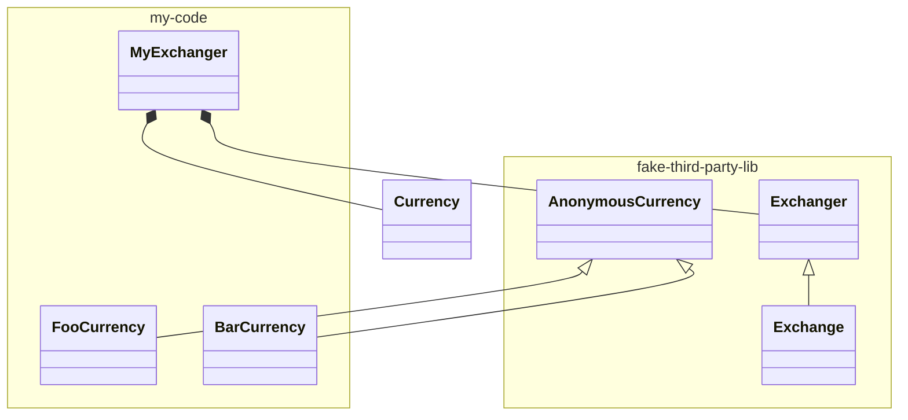

# Java言語仕様学習

## 期待するゴール

* 筆者が言語を扱っている中で、コードベースで仕様を把握・確認しサンプルコードを実装すること

## ジェネリクス

### サンプル

* Third party製（仮）の通貨両替機能を利用し、通貨Foo、通貨Barそれぞれの任意の金額を算出する
* 通貨両替機能
  * 任意の通貨の種類と金額をもとに、最適な通貨枚数を算出する
* 通貨種類
  * Bar
    * 単位：Bar
    * 額
      * 8 
      * 3 
      * 1 
  * Foo
    * 単位：Foo
    * 額
      * 10
      * 5
      * 1

